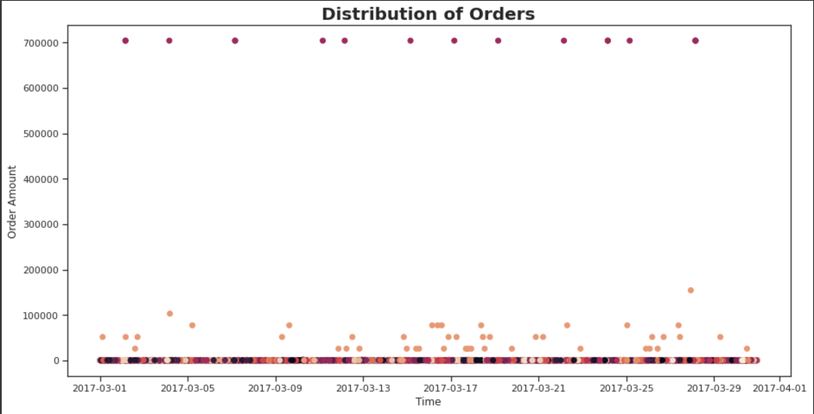
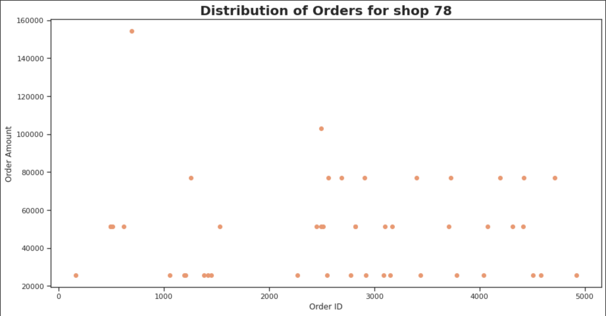

# Shopify-Data-Science-Challenge-Summer-2022

## Data Analysis

For data analysis, firstly i calculated the AOV(Average Order Value) of the data and checked that indeed the AOV is $3145.13.

On futher analysis I checked the normal distribution of the data and according to the figure, we can see that the data is left skewded i.e. the data is highly inclined to one side. **A major cause for the increase in the mean value**.


To further investigate, I decided to plot the order amount of the data per the date of the order and found that there are many outliers that are causiing the skewness of the data **magenta** and the **orange** points.

 

The source of these outliers came out to be shop ID 42 and 78.

- For Shop ID 42, it is found that the shop is taking multiple orders of amount $704000 and 2000 items.

 

- For Shop ID 78, it is found that the shop is are sellig very expensive sneakers.

 

The complete analysis to the data can be found at the [Notebook](https://github.com/gargpriyam21/Shopify-Data-Science-Challenge-Summer-2022/blob/master/Question%201/Shopify_Data_Science_Intern_Challenge.ipynb)

# Questions

## Question 1

### **a) Think about what could be going wrong with our calculation. Think about a better way to evaluate this data.**

As per the data analysis I can say that the data is kewed and causing the AOV to be increased than the actual value. Ee can better evaluate this data by calculating at what order amount the data is divided equally.

### **b)What metric would you report for this dataset?**

We can use MOV(Median Order Value)

### **c)What is its value?**

284


## Question 2

### **a) How many orders were shipped by Speedy Express in total?**

[a.sql](https://github.com/gargpriyam21/Shopify-Data-Science-Challenge-Summer-2022/blob/master/Question%202/a.sql)

```
SELECT
  COUNT(DISTINCT(OrderID))
FROM
  [ Orders ] O
  LEFT JOIN [ Shippers ] S ON O.ShipperID = S.ShipperID
WHERE
  S.ShipperName = 'Speedy Express';
```

**Result** 54

### **b)What is the last name of the employee with the most orders?**

[b.sql](https://github.com/gargpriyam21/Shopify-Data-Science-Challenge-Summer-2022/blob/master/Question%202/b.sql)

```
SELECT
  Lastname
FROM
  [ Employees ]
WHERE
  EmployeeID IN (
    SELECT
      EmployeeID
    from
      (
        SELECT
          EmployeeID,
          COUNT(OrderID) as Orders
        FROM
          [ Orders ]
        GROUP BY
          EmployeeID
      )
    where
      Orders = (
        SELECT
          MAX(Orders)
        from
          (
            SELECT
              EmployeeID,
              COUNT(OrderID) as Orders
            FROM
              [ Orders ]
            GROUP BY
              EmployeeID
            ORDER BY
              Orders DESC
          )
      )
  )
```

**Result** Peacock

### **c)What product was ordered the most by customers in Germany?**

[c.sql](https://github.com/gargpriyam21/Shopify-Data-Science-Challenge-Summer-2022/blob/master/Question%202/c.sql)

```
SELECT
  ProductName,
  MAX(Product_Count) as Product_Count
FROM
  (
    SELECT
      P.ProductName,
      COUNT(1) as Product_Count
    FROM
      [ OrderDetails ] OD
      INNER JOIN [ Products ] P on P.ProductID = OD.ProductID
      INNER JOIN [ Orders ] O on O.OrderID = OD.OrderID
      INNER JOIN [ Customers ] C on O.CustomerID = C.CustomerID
    WHERE
      C.Country = 'Germany'
    GROUP BY
      OD.ProductId
    ORDER BY
      Product_Count DESC
  )
```

**Result** Gorgonzola Telino	with ordered 5 times
